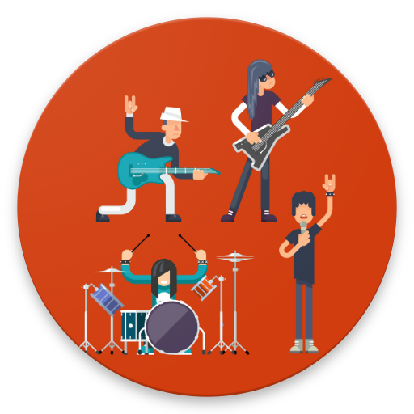

<h1 align="center">
  
</h1>

<p align="center">
  

 
</p>


## 💻 Project
An example application to consult your favorite bands developed with RN CLI, propTypes, axios, react navigation V5 and simple jest tests.


## Features 

-   [ ] Save your favorite band;
-   [ ] List of all bands;
-   [ ] List of all bands offline;

## ✨ Technologies

-   [ ] React Native CLI
-   [ ] Async Storage
-   [ ] Vector Icons
-   [ ] Axios
-   [ ] Gradient colors 
-   [ ] React Navigation V5
-   [ ] React Native Gesture Handler
-   [ ] React Native Sensitive Info

## 🔖 Layout

You can view the project layout through [desse link](https://www.figma.com/file/0kv33XYjvOgvKGKHBaiR07/GamePlay-NLW-Together?node-id=58913%3A83). It is necessary to have an account in the [Figma](http://figma.com/) to access it.


## Running the project

Use **yarn** or **npm install** to install project dependencies.
Then start the project.


## Running the tests

Use **yarn jest -u** or **jest test** to execute the jest tests.

```cl
yarn jest or yarn test
```

## 📄 Environment
 ```cl
BASE_URL=
API_KEY=
```


## 📄 Licence

This project is under the MIT license. See the file [LICENSE](LICENSE.md) for more details.

<br />

<div align="center">
  <small>Development for Alexandre carvalho marques - 2021/Set</small>
</div>